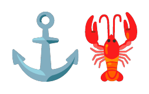

<p align="center">
  
</p>

<h1 align="center">Command Claw</h1>

<p align="center">
  <strong>Git-native agent platform built for enterprise reliability and control.</strong><br>
  <em>A ground-up redesign of OpenClaw — your vault commands the agents, not the other way around.</em><br>
  <sub>Configuration, memory, and behavior rules live in files you can inspect, edit, version, and audit.</sub>
</p>

---

> [!WARNING]
> **Beta Software** — This project is under active development. Workflows and commands may be incomplete or broken. Your feedback helps make this better!
>
> Have feedback or found a bug?  Reach out at [**@_Shikh4r_** on X](https://x.com/_Shikh4r_)

## Quick Start

```bash
# 1. Clone the repos
gh repo clone FnSK4R17s/commandclaw
gh repo clone FnSK4R17s/commandclaw-vault

# 2. Configure
cd commandclaw
cp .env.example .env
# Edit .env — set COMMANDCLAW_OPENAI_API_KEY

# 3. Spawn an agent (creates workspace + Docker container)
./scripts/spawn-agent.sh
# → Spawning agent: brave-panda-4821

# 4. Resume an existing agent
./scripts/spawn-agent.sh brave-panda-4821

# 5. List all agents
./scripts/spawn-agent.sh --list
```

Each agent gets its own isolated workspace cloned from the [commandclaw-vault](https://github.com/FnSK4R17s/commandclaw-vault) template, named with the chakravarti-cli convention: `adjective-animal-NNNN`. The agent ID is the workspace name.

```
~/.commandclaw/workspaces/
  brave-panda-4821/     ← Agent vault (Git repo)
  swift-falcon-0137/    ← Another agent
```

## Containerized Agents

Agents run inside persistent Docker containers with filesystem isolation:

- `/workspace` — the vault, mounted from `~/.commandclaw/workspaces/<agent-id>/`
- No host filesystem access beyond the vault
- 512MB memory, 1 CPU limit
- Read-only root filesystem, tmpfs for `/tmp` and `/home/agent`
- Connected to the MCP gateway via Docker network

```bash
# Spawn new agent in container
./scripts/spawn-agent.sh

# Run locally (dev mode, no container)
COMMANDCLAW_AGENT_ID=brave-panda-4821 python -m commandclaw chat
```

## Agent Tools

| Tool | Description |
|------|-------------|
| `bash` | Execute shell commands (scoped to `/workspace` in container) |
| `file_list` | List files and directories in the vault |
| `file_read` | Read a file from the vault |
| `file_write` | Create or overwrite a file in the vault |
| `file_delete` | Delete a file from the vault |
| `memory_read` | Read long-term memory and daily notes |
| `memory_write` | Write to daily notes or long-term memory (auto-commits to Git) |
| `list_skills` | Discover available skills |
| `read_skill` | Load a skill's full instructions |

All file tools are sandboxed to the vault directory. Path traversal outside the vault is rejected.

## Repositories

| Repo | Purpose |
|------|---------|
| [commandclaw](https://github.com/FnSK4R17s/commandclaw) | Agent runtime, Telegram I/O, tracing |
| [commandclaw-vault](https://github.com/FnSK4R17s/commandclaw-vault) | Vault template — cloned per agent workspace |
| [commandclaw-mcp](https://github.com/FnSK4R17s/commandclaw-mcp) | MCP gateway — credential proxy with rotating keys |
| [commandclaw-gateway](https://github.com/FnSK4R17s/commandclaw-gateway) | LLM routing layer — provider credentials, virtual keys, budgets, rate limits, multi-provider fallback |
| [commandclaw-skills](https://github.com/FnSK4R17s/commandclaw-skills) | Skills library — `npx skills add FnSK4R17s/commandclaw-skills` |
| [commandclaw-memory](https://github.com/FnSK4R17s/commandclaw-memory) | Recall service — wiki validation, LanceDB + BM25 indexing, distillation, hybrid retrieval |
| [commandclaw-wiki](https://github.com/FnSK4R17s/commandclaw-wiki) | LLM Wiki — persistent, compounding knowledge base per agent (Karpathy pattern) |
| [commandclaw-observe](https://github.com/FnSK4R17s/commandclaw-observe) | Self-hosted observability — Langfuse tracing + Prometheus + Grafana, one compose |
| [openclaw](https://github.com/FnSK4R17s/openclaw) | Original personal AI assistant — predecessor to CommandClaw |

## Architecture

See [guiding_docs/VISION.md](guiding_docs/VISION.md) for the full vision and [guiding_docs/DEVLOG.md](guiding_docs/DEVLOG.md) for the daily development log.

**Three layers:**

1. **Agent Runtime** — LangGraph + OpenAI execution loop. Each agent runs independently in its own container with its own Git vault.
2. **Skills Layer** — Markdown files describing agent capabilities. Managed by admins, not agents.
3. **MCP Layer** — Authentication-gated sensitive operations with access control at the protocol level.

**Core principle:** The vault (Git repo) is the control plane, not chat. Configuration, memory, and behavior rules live in files you can inspect, edit, version, and audit.

## Workspace-Per-Agent

Each agent gets an isolated workspace:

1. `spawn-agent.sh` generates an agent ID (`adjective-animal-NNNN`)
2. Clones `commandclaw-vault` template into `~/.commandclaw/workspaces/<agent-id>/`
3. Initializes a fresh Git repo for the vault
4. Launches a Docker container with the vault mounted at `/workspace`

The agent ID is the workspace name — no separate concept. Resume an agent by its name: `./scripts/spawn-agent.sh brave-panda-4821`

## Configuration

**Two config files**, both at `~/.commandclaw/` (outside Git):

| File | Purpose | Who edits |
|------|---------|-----------|
| `mcp.json` | Gateway settings, upstream servers, credentials | DevOps/admin |
| `agents.json` | Per-agent roles, tool grants, rate limits | Agent operators |

**Environment variables** (`.env`):

```bash
COMMANDCLAW_OPENAI_API_KEY=sk-...          # Required
COMMANDCLAW_AGENT_ID=brave-panda-4821      # Resume specific agent (optional)
COMMANDCLAW_OPENAI_MODEL=gpt-5.4-mini      # Default model
```

## MCP

Agents interact with external tools via the [commandclaw-mcp](https://github.com/FnSK4R17s/commandclaw-mcp) gateway:

- **Phantom tokens** — agents get opaque, short-lived tokens. Real API keys never leave the gateway.
- **HMAC-signed requests** — every request is signed, preventing forgery even with a stolen token.
- **Dual-layer RBAC** — Cerbos policy engine filters tools at discovery and enforces at call time.
- **Hourly key rotation** — leaked keys expire within 60 minutes.

```
Agent → (phantom token + HMAC) → commandclaw-mcp gateway → (real credentials) → External MCP Servers
```

## Skills

Skills are markdown files in `.agents/skills/` within each agent's vault:

```bash
npx skills add FnSK4R17s/commandclaw-skills
```

Skills are managed by administrators, not agents. Agents can read and use skills but cannot install, update, or remove them.

## Migrating from OpenClaw

```bash
./scripts/migrate-from-openclaw.sh /path/to/openclaw/workspace /path/to/commandclaw/vault
```
